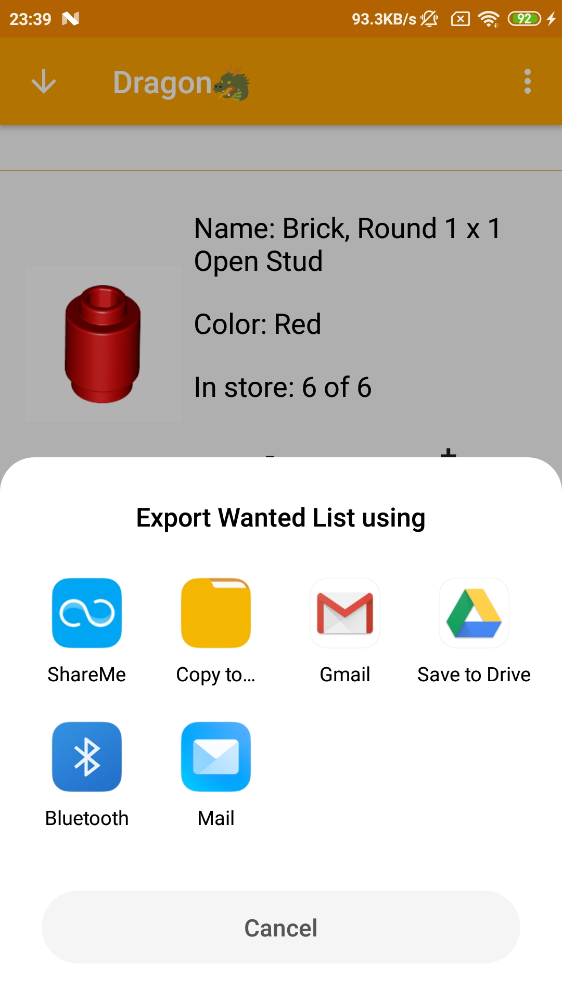

# BrickList
- created using Android Studio 
- API 24 - Android 7.0 
- tested on Xiaomi Redmi Note 4 with Android 7.0 and Pixel 3a with Android 10 - API 29 (virtual device) 
 
Screenshots:  

  
  
  
  
  
  
  

